# 🔖 MongoDB Vector RAG MCP Demo
> *AI-powered contract analysis using MongoDB Vector Search with Model Context Protocol architecture for MongoDB & GitLab hackathon*  

## 0. Document Control
| Version | Date | Author | Reviewer | Notes |
|---------|------|--------|----------|-------|
| 1.0 | 2025-06-18 | Seth Upavan | - | Initial deployment spec |

## 1. Executive Summary
- **Problem & goal**: Enable AI-powered analysis of contract documents using MongoDB's vector search capabilities with a Model Context Protocol (MCP) architecture
- **Target users**: Legal professionals, contract analysts, developers working with document analysis
- **Key outcomes / KPIs**: 
  - Query response time ≤ 10 seconds p95
  - Support 666+ document chunks with vector similarity search
  - 100% cloud deployment (GCP + Vercel)

## 2. Scope
### 2.1 In-Scope
- MongoDB Atlas vector search on contract documents
- AI-powered query processing with OpenAI GPT-4o-mini
- Terminal-style web interface for document queries
- MCP (Model Context Protocol) architecture
- Google Cloud Run backend deployment
- Vercel frontend deployment
- Real-time document analysis with source attribution

### 2.2 Out-of-Scope (Non-Goals)
- Document upload/ingestion functionality
- Multi-user authentication system
- Document editing capabilities
- Real-time collaboration features
- Mobile app development

## 3. Stakeholders & Sign-off
| Role | Name | Area of concern | Signature |
|------|------|-----------------|-----------|
| Developer | Seth Upavan | Full-stack implementation | ✅ |
| Hackathon Judges | MongoDB/GitLab | Technical evaluation | Pending |

## 4. Background & Context
- **Existing pain points**: Manual contract analysis is time-consuming and error-prone
- **Competing or legacy systems**: Traditional keyword search lacks semantic understanding
- **Regulatory or contractual drivers**: MongoDB & GitLab hackathon submission demonstrating vector search capabilities

## 5. High-Level Architecture
### 5.1 System Overview
The system implements a RAG (Retrieval-Augmented Generation) pattern with MongoDB vector search for document retrieval and OpenAI for response generation.

### 5.2 Component Breakdown
| Component | Responsibility | Tech choice | Alt options rejected & why |
|-----------|----------------|-------------|----------------------------|
| Frontend | User interface & query submission | Next.js 15 + Tailwind | React only - wanted SSR capabilities |
| Backend API | Query processing & AI integration | FastAPI + Python | Express.js - better ML ecosystem in Python |
| Vector Database | Document storage & similarity search | MongoDB Atlas | Pinecone - wanted to showcase MongoDB |
| AI/LLM | Response generation | OpenAI GPT-4o-mini | Local models - faster inference needed |
| Embeddings | Text vectorization | OpenAI text-embedding-ada-002 | Sentence Transformers - consistency with LLM |

### 5.3 Data-Flow Diagram


### 5.4 Deployment Topology
- **Environments**: Production only (hackathon demo)
- **Regions**: us-central1 (Google Cloud), Global CDN (Vercel)
- **Architecture**: Serverless deployment pattern

### 5.5 External Integrations
| System | API | Auth method | Throttle limits | Failure mode |
|--------|-----|-------------|-----------------|--------------|
| MongoDB Atlas | Driver connection | Connection string | 500 ops/sec | Graceful degradation |
| OpenAI API | REST API | API Key | 3500 RPM | Error response to user |
| Google Cloud Run | HTTP | Service account | Auto-scaling | 503 on overload |

## 6. Functional Requirements
### 6.1 User Stories
- **US-01** - *As a* legal analyst *I want* to query contract terms *so that* I can quickly understand payment clauses
- **US-02** - *As a* developer *I want* to see technical implementation *so that* I can understand MCP architecture
- **US-03** - *As a* user *I want* real-time responses *so that* I can efficiently analyze multiple contracts

### 6.2 API Contract
```http
POST /api/query
Content-Type: application/json
{
  "query": "What are the payment terms?",
  "collection": "contract_analysis"
}

Response: 200 application/json
{
  "response": "AI-generated analysis with source attribution",
  "success": true,
  "mode": "cloud-api"
}
```

### 6.3 UI/UX Requirements
- Terminal aesthetic with green/orange color scheme
- Real-time typing indicators during processing
- Markdown rendering for AI responses
- Responsive design for desktop/tablet usage

## 7. Non-Functional Requirements

| Category | Requirement | Metric/Target |
|----------|-------------|---------------|
| Performance | p95 ≤ 10s for complex queries | 95th percentile |
| Scalability | Handle concurrent users | Auto-scale Cloud Run |
| Security | API key protection, HTTPS only | SSL/TLS encryption |
| Availability | ≥ 99% uptime | Monitored via Cloud Run |
| Observability | Request logging and error tracking | Cloud Logging |

## 8. Data Model

### 8.1 Document Schema
```javascript
{
  _id: ObjectId,
  content: "Contract text chunk",
  metadata: {
    source: "document_name.pdf",
    page: 1,
    chunk_index: 0
  },
  contentVector: [0.1, 0.2, ...], // 1536-dimensional embedding
  createdAt: ISODate
}
```

### 8.2 Vector Index Configuration
```javascript
{
  "mappings": {
    "dynamic": true,
    "fields": {
      "contentVector": {
        "dimensions": 1536,
        "similarity": "cosine",
        "type": "knnVector"
      }
    }
  }
}
```

## 9. Detailed Design

### 9.1 System Architecture Diagram

```mermaid
graph TB
    User[👤 User] --> Frontend[🌐 Next.js Frontend<br/>Vercel]
    Frontend --> API[🔧 FastAPI Backend<br/>Google Cloud Run]
    API --> Embed[🤖 OpenAI Embeddings<br/>text-embedding-ada-002]
    API --> DB[(🍃 MongoDB Atlas<br/>Vector Search)]
    API --> LLM[🧠 OpenAI GPT-4o-mini<br/>Response Generation]
    
    DB --> Vector[📊 Vector Index<br/>1536 dimensions<br/>cosine similarity]
    
    style Frontend fill:#1a1a1a,stroke:#00ff00,color:#00ff00
    style API fill:#1a1a1a,stroke:#ff8c00,color:#ff8c00
    style DB fill:#1a1a1a,stroke:#4ade80,color:#4ade80
    style LLM fill:#1a1a1a,stroke:#60a5fa,color:#60a5fa
```


### 9.2 Key Algorithms
- **Vector Similarity Search**: Cosine similarity matching with configurable threshold (0.7 default)
- **Semantic Chunking**: 1000-character chunks with 200-character overlap
- **Response Generation**: RAG pattern with retrieved context injection

### 9.3 Query Processing Flow


## 10. Technology Choices & Rationale

| Layer | Option chosen | Why it wins | Alternatives |
|-------|---------------|-------------|--------------|
| Frontend | Next.js 15 + Tailwind | SSR, modern React, great DX | Vanilla React, Vue.js |
| Backend | FastAPI + Python | Fast development, ML ecosystem | Express.js, Django |
| Database | MongoDB Atlas | Vector search capabilities | PostgreSQL + pgvector |
| Deployment | Google Cloud Run + Vercel | Serverless, auto-scaling | AWS Lambda, Railway |
| AI | OpenAI GPT-4o-mini | Reliable, fast inference | Claude, local models |

## 11. Deployment & Ops

### 11.1 CI/CD Pipeline
1. **Build** → Docker image creation via Google Cloud Build
2. **Deploy** → Automatic deployment to Cloud Run
3. **Frontend** → Git push triggers Vercel deployment

### 11.2 Environment Configuration
- **Backend**: Environment variables in Cloud Run (MongoDB URI, OpenAI API key)
- **Frontend**: API endpoint configuration for cloud backend
- **Secrets**: Managed via Google Cloud Secret Manager and Vercel environment variables

### 11.3 Monitoring & Alerting
- **Dashboards**: Google Cloud Console, Vercel Analytics
- **Logging**: Cloud Run request logs, application logs
- **Error Tracking**: Console error logging

## 12. Testing Strategy

| Level | Responsible | Tooling | Pass criteria |
|-------|-------------|---------|---------------|
| Manual | Developer | Browser testing | Query responses work |
| Integration | Developer | curl/Postman | API endpoints functional |
| Load | N/A | Manual testing | Responsive under load |

## 13. Risk Register

| # | Risk | Likelihood | Impact | Mitigation / Owner |
|---|------|------------|--------|--------------------|
| 1 | OpenAI API rate limits | Medium | High | Implement retry logic |
| 2 | MongoDB connection issues | Low | High | Connection pooling + retry |
| 3 | Cost overrun | Low | Medium | Monitor usage dashboards |
| 4 | Vector search accuracy | Medium | Medium | Tune similarity thresholds |

## 14. Cost Estimate

| Resource | Qty | Unit cost | Monthly total |
|----------|-----|-----------|---------------|
| Google Cloud Run | Variable | $0.40/million requests | ~$5-20 |
| MongoDB Atlas | M0 Free | $0 | $0 |
| OpenAI API | Variable | $0.50/1M tokens | ~$10-50 |
| Vercel | Hobby | $0 | $0 |
| **Total** | | | **$15-70/month** |

## 15. Timeline & Milestones


## 16. Future Work
- Document upload and processing pipeline
- Multi-collection support
- User authentication and session management
- Advanced query filters and sorting
- Real-time collaboration features
- Mobile-responsive improvements

## 17. Appendix

### 17.1 Glossary
- **RAG** – Retrieval-Augmented Generation
- **MCP** – Model Context Protocol
- **Vector Search** – Similarity search using high-dimensional vectors
- **Embedding** – Numerical representation of text for ML processing

### 17.2 Reference Documents
- MongoDB Vector Search Documentation
- OpenAI API Documentation
- Next.js 15 App Router Guide
- Google Cloud Run Documentation

### 17.3 Live Deployment URLs
- **Frontend**: https://mongo-rag-mcp-demo-dt5y0pxw9-seth-hackathonprojects.vercel.app
- **Backend API**: https://mongodb-rag-api-538997625380.us-central1.run.app
- **Health Check**: https://mongodb-rag-api-538997625380.us-central1.run.app/health

---

**Status**: ✅ **DEPLOYED AND OPERATIONAL**  
**Last Updated**: 2025-06-18  
**Demo Ready**: Yes - Full hackathon submission complete 